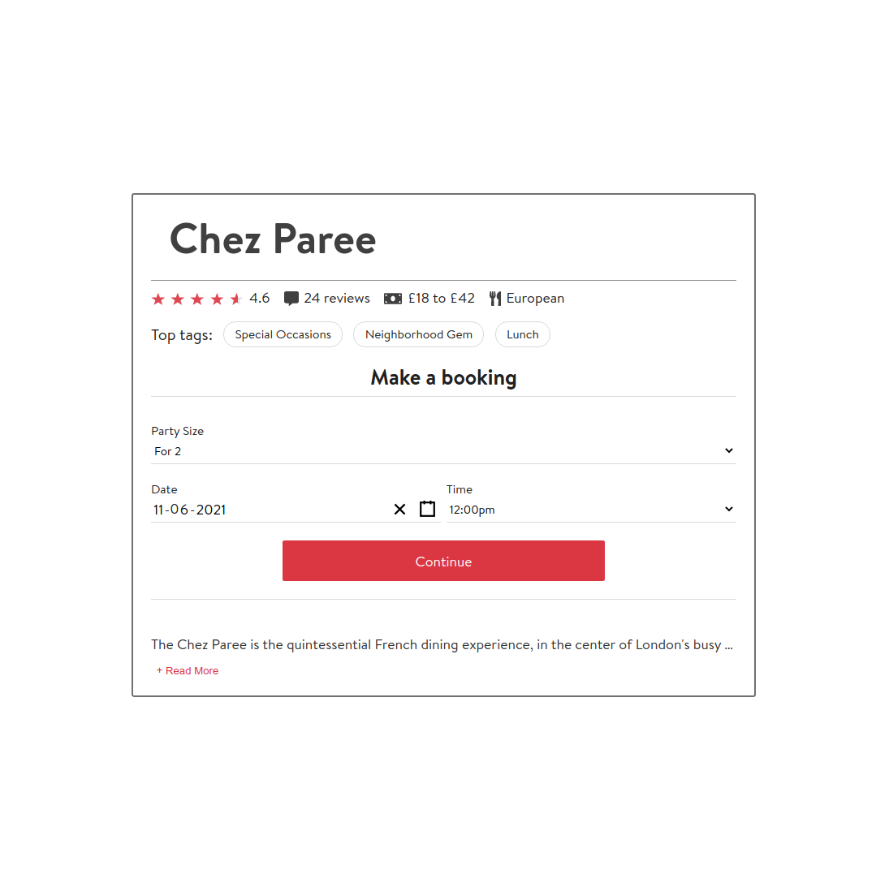
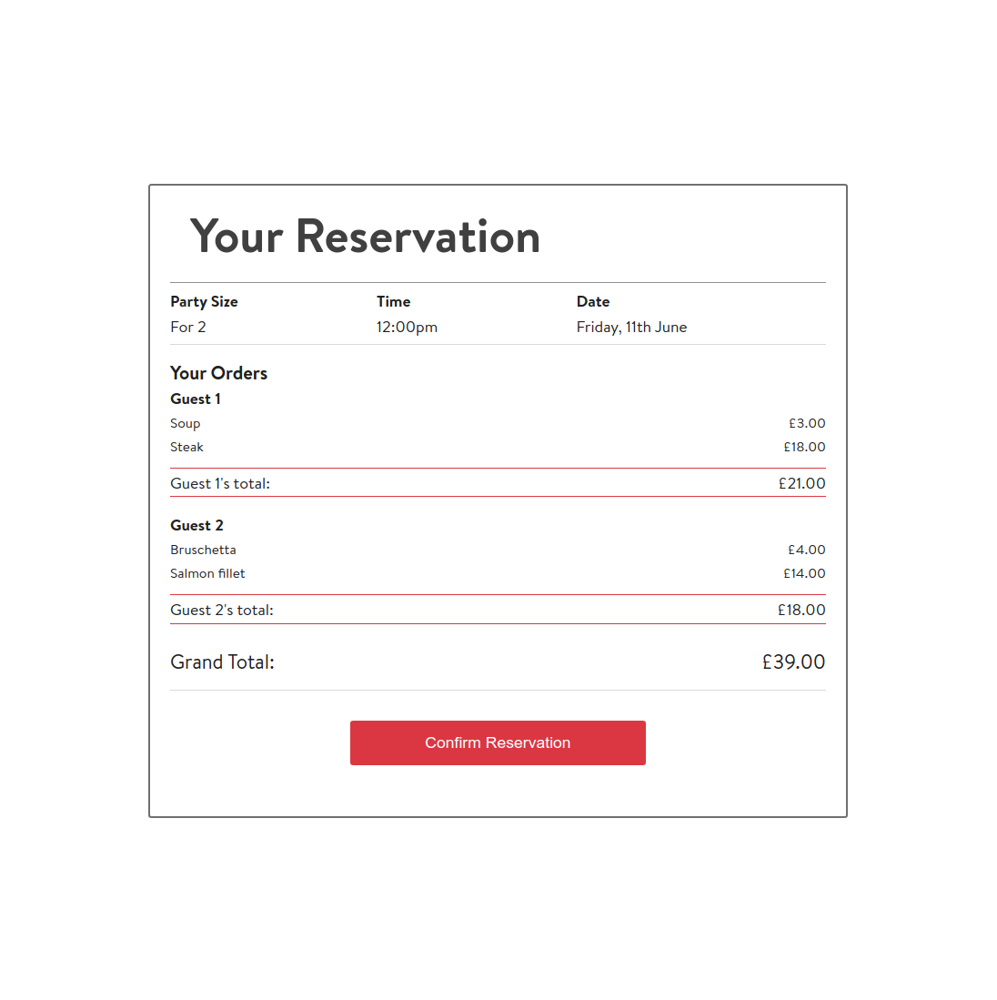
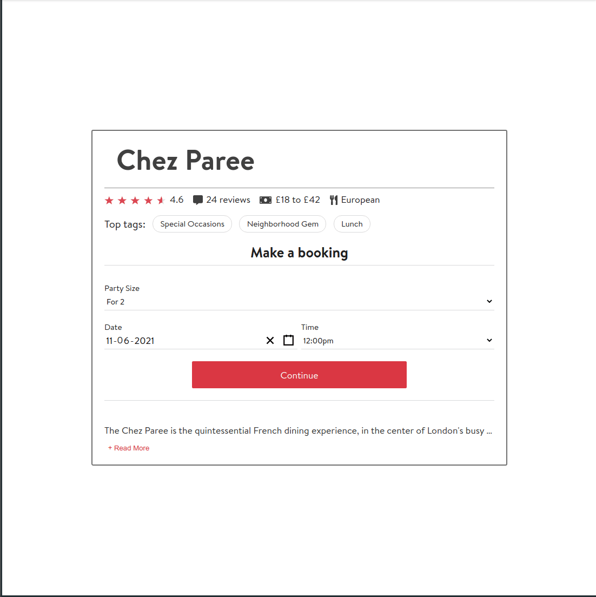

# OpenTable Front-End Coding Challenge

## Table of Contents
  - [Assessment Brief](https://github.com/Rhelli/thrive.io-frontend#-the-project-brief)
  - [The Technical Requirements](https://github.com/Rhelli/thrive.io-frontend#-the-technical-requirements)
  - [The App](https://github.com/Rhelli/thrive.io-frontend#the-app)
  - [Design](https://github.com/Rhelli/thrive.io-frontend#%EF%B8%8F-application-architecture)
  - [Architecture](https://github.com/Rhelli/thrive.io-frontend#-tools--technology-used)
  - [Redux, State & Data](https://github.com/Rhelli/thrive.io-frontend#-setup--use)
  - [Setup & Use](https://github.com/Rhelli/thrive.io-frontend#%EF%B8%8F-feature-previews)
  - [Preview Video](https://github.com/Rhelli/thrive.io-frontend#%EF%B8%8F-contributions-issues-and-forking)
  - [Creator](https://github.com/Rhelli/thrive.io-frontend#-creator)

## Assessment Brief
This is the front-end challenge provided on behalf of [OpenTable](https://www.opentable.com), to be completed in an open ended amount of time in order to relay my front-end programming strengths.

## Technical Requirements
The task at hand is to build a web application that performs the following:
 - Allows one user to select dishes on behalf of two diners;
 - Presents the menu that may later be changed by the restaurant;
 - Enforces certain restrictions made by the restaurant.

 The basic structure for the project was provided, and the data for the menu was additionally provided as JSON data.

### Application Ordering Rules
  1. The application will allow ordering for a fixed number of 2 diners;
  2. Each diner must have at least 2 courses, with one being a main course;
  3. There is only one piece of Cheesecake left;
  4. Pierre the snobby waiter will not let you have prawn cocktail and salmon fillet in the same meal.

## The App
### Technology
**Languages & Frameworks**
 - JSX
 - ES6 Javascript
 - Sass
 - React (17.0.2)
 - Redux
 - Jest

**Packages Of Note**
 - Webpack (4.44.2)
 - Prop-Types
 - Redux-Thunk
 - Enzyme
 - React-testing-library

**Linters**
 - Eslint (OpenTable Config)
 - StyleLint

### File Structure
The file structure of this application follows a ['View-State'](https://www.pluralsight.com/guides/how-to-organize-your-react-+-redux-codebase) split structure in order to fully separate out the redux 'state' logic and react 'view' logic. 

This promotes a cleaner, more compartmentalised structure. Downside is it is difficult to use for larger projects and forces extrapolation of pure logic focuses code into a separate `utils` folder. The image below is an example of a View-State split structure.
    
    └── src
        ├── api
        │   ├── apiHandler.js
        │   ├── articleApi.js
        │   ├── categoryApi.js
        │   └── userApi.js
        ├── common
        │   ├── components
        │   │   └── ArticleComponent.jsx
        │   └── containers
        │       └── ArticleContainer.js
        ├── index.js
        ├── pages
        │   ├── CategoryPage
        │   │   ├── CategoryPageContainer.js
        │   │   └── components
        │   │       └── CategoryPageComponent.jsx
        │   └── HomePage
        │       ├── components
        │       │   ├── ArticleListComponent.jsx
        │       │   ├── CategoryComponent.jsx
        │       │   └── HomePageComponent.jsx
        │       └── HomePageContainer.js
        ├── routes.js
        ├── state
        │   ├── article
        │   │   ├── articleActions.js
        │   │   └── articleReducer.js
        │   ├── category
        │   │   ├── categoryActions.js
        │   │   └── categoryReducer.js
        │   ├── middleware.js
        │   ├── store.js
        │   └── user
        │       ├── userActions.js
        │       └── userReducer.js
        └── utils
            └── authUtils.js

## Design
I designed and built this project as if it were to become a new feature for OpenTable. The design elements are lifted from OpenTable's own.

An additional important caveat here is that the project is not responsive. Given an appropriate amount of time, enabled a responsive experience would be no bother, as the application itself is designed a composed in a modular way, meaning all that needs to happen, is rearranging of the page components order.
    

## Architecture
Following the file structure laid out above, the application is structured through three main containers, which act as the key pages or points throughout the user journey:

 1. **Welcome** - This is the first page, where the user enters their booking time request, and optionally, their names so that they may organise the food they order
 
 2. **Menu** - This is the center of the experience, where the menu is displayed with selectable options and selected options are added to the 'Order Card', with pricing, totals and selected food being displayed.

 3. **Confirmation** - This is the last page, where the users booking details and food selection is presented back to them one last time before the booking/order is confirmed.

 ### Welcome Container
 This container is fairly simple. The restaurant title is at the top, and some quick, digestable information about the restaurant is presented. This design is lifted straight from OpenTable's own, as I intended for the application's feel and fit to match OpenTable's design.
 
 

### Menu Container
This container is more complex, with the majority of data, state and components flowing through it. It is comprised of 5 main components:

  1. The Menu Nav Bar - This provides the title but also the 'user buttons' feature, which allows users to swap between who is currently ordering and adding to their bill
  2. The Menu Card - All elements are selectable and will add to the current users order (as long as they satisfy the restrictions)
  3. The Order Card - Here the users order, personal sub total, as well as the grand total for the bill is displayed. Removal of orders is possible.
  4. Navigation buttons - self explanatory. The 'next' button performs a final check on whether the users have ordered at least one main and another dish.
  5. The Waiter Card - Instructions (or complaints) from Pierre are displayed here in IM chat style. If the user triggers a restriction, a message about it pops up here to notify the user.

   

### Confirmation Container
Much like the Welcome Container, this container is very simple. It simply compiles all of the information that the users have entered concerning their booking and orders and presents it for review. In a full stack environment, this may be the point at which the information is fired off to the backend.

   

## Redux, State & Data
The state for the application is controlled largely through Redux, however there additionally some use of React's `useState` in relevant places where dispatching and retrieving from the store is excessive. The Redux store is channeled through 3 main reducers.

### The Order Reducer
This is the most complex reducer, as it structures and manages the user's order information. The initial state for the order reducer is as follows:

    orderStore: {
      bookings: {},
      orders: {}
    }

As the users enter their booking information and complete their orders and head to the confirmation page, the order state will more closely resemble the following (taken from an end instance):

    orderStore: {
      booking: {
        partySize: 2,
        time: 19:30pm,
        date: 2021-06-23T23:00:00.000Z
      },
      orders: {
        Merry: {
          color: {
          backgroundColor: #F7DC6F
        },
        starters: {
          food:Soup,
          price:3
          },
          mains: {
            food: Steak,
            price: 18
          },
          desserts: {
            food: Tiramisu,
            price: 4.5
          }
        },
        Pippin: {
          color: {
            backgroundColor: #58D68D
          },
          starters: {
            food: Bruschetta,
            price: 4.5
          },
          mains:{
           food: Meatballs,
           price: 11.5
          },
          desserts: {}
          }
        }
      }

In taking advantage of the way that the orders are structures (i.e. as objects), we're able to fulfill the restriction that a user may only have one item per course. When we update the state, we use bracket notation to point to the relevant course, and overwrite it with a new chosen meal. This prevents having to perform any other checks for more than one meal per course being selected. The user's assigned color is also stored in the order information, as it is relevant to the menu container where it is used.

The reducers corresponding actions include:
 - **Create New Booking** - Initialised once the user completes the Welcome screen, creating the booking object
 - **Create New Order** - Initialised upon reaching the menu screen to create each users `order` object
 - **Add To Order** - Initialised when the user selects a food item from the menu
 - **Remove From Order** - Initialised when the user removes an order from the Order Card
 - **Reset Order** - Initialised when the user navigated back to the Welcome screen. Triggering this wipes the orders and prevents proliferation of users if the user returns to the Welcome screen, creates a new user and then proceeds back to the Menu screen.

### The Stock Reducer
The stock reducer is a very simple reducer that ties in closely with the order reducer in order to either decrement of increment the stock of the chosen food upon selection. The initial state for the stock reducer is created through a utility function called `menuGen` (found in `./src/utils/menuUtils.js`). 

The function creates an object structure similar to the JSON menu data, but it maps a given stock number to each food item. One chosen food item, denoted by a string input into the `menuGen`'s last parameter, sets a low-stock item at 1. For this project, that item is the cheesecake, however it can be readily modified my altering the stock reducers set initial state in `stockReducer.js`. The initial state for the structure is as following:

    stockStore: {
      starters: { 
        Soup: 30, 
        Pâté: 30, 
        Bruschetta: 30, 
        Prawn cocktail': 30 
      },
      mains: {
        Steak: 30,
        Meatballs: 30,
        Salmon fillet: 30,
        Vegetarian lasagna': 30
      },
      desserts: { 
        Sticky toffee: 30, 
        Tiramisu: 30, 
        Cheesecake: 1, 
        Ice cream: 30 
      }
    }

The stock reducers corresponding actions include:
 - **Increase stock** - Triggered when a user removes an order from the Order Card
 - **Decrease stock** - Triggered when a user adds an order to the Order Card
 - **Reset Stock** - Triggered when the user returns to the Welcome screen to prevent stock bugs.

### Waiter Reducer
The waiter reducer is another simple reducer that controls the flow of messages the appear on the menu screen. The data structure is a simple one dimensional array, where messages produced by waiter util functions (found in `./src/utils/waiterUtils`) are dispatched depending on checks on orders that occur when a user is either submitting a new food order, or attempting to proceed to the Confirmation screen. An example of what the state for this reducer looks like is as follows:

    messageList: [
      "Good Afternoon, my name is Pierre, and I'll be your waiter this afternoon.",
      "To order, select your name at the top of the menu and make your selections. The first guest's name is selected automatically.",
      "*snorts* I urge you to choose a better suited main course to complement your starters. Unless you're a pescatarian or a philanderer, I'd suggest selecting something else.","Guest 2, you have not completed your order. Please ensure you have a main course and a starter or dessert."
    ]

The waiter reducers corresponding actions are as follows:
 - **Trigger Waiter Message** - Dispatches a generated message to the waiterStore
 - **Remove Waiter Message** - This is an unused action, however it is fully plumbed in and I have left it there as a readily available solution if deletion of messages is wanted in the future.

## Setup and Use
### Setup
In order to run this project locally, you must first ensure your machine is correctly set up.
  1. Ensure you have Node.js installed on your machine.
  2. Download this repository. This can be done as a typical file download from [here]() or ou can clone this repository to a given directory on your machine from the link at the top of the page.
  3. Once downloaded, navigate to the root of the downloaded repository in a terminal.
  4. Install! - Enter the command `npm install --legacy-peer-deps`. Legacy peer dependencies are required for this project to install due to the use of the [Recompose](https://github.com/acdlite/recompose) npm package which is used to prevent unnecessary re-renders/animation re-triggers in the WaiterCardComponent.

The following steps should correctly set up and install the project locally. Once the last step has completed, you're free to start playing around!

### Use
There are a number of commands that can be executed on the command line to interact with the project:
 - `npm run start` - This will start the project in a local server, accessible at `http://localhost:8080/`.
 - `npm run build` - This will compile the project and output to `./public/webpack`.
 - `npm run test` - This will run all Jest tests for the project.

## Preview Video
   

## Creator
Rory Hellier -[Github](https://github.com/Rhelli)