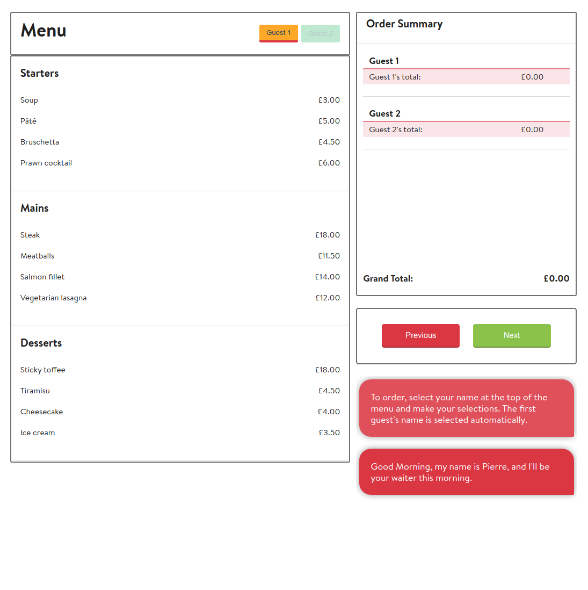

# OpenTable Front-End Coding Challenge

## Challenge Brief
This is the front-end challenge provided on behalf of [OpenTable](https://www.opentable.com), to be completed in an open ended amount of time in order to relay my front-end programming strengths.

## Technical Requirements
The task at hand is to build a web application that performs the following:
 - Allows one user to select dishes on behalf of two diners;
 - Presents the menu that may later be changed by the restaurant;
 - Enforces certain restrictions made by the restaurant.

 The basic structure for the project was provided, and the data for the menu was additionally provided as JSON data.

### Application Ordering Rules
  1. The application will allow ordering for a fixed number of 2 diners;
  2. Each diner must have at least 2 courses, with one being a main course;
  3. There is only one piece of Cheesecake left;
  4. Pierre the snobby waiter will not let you have prawn cocktail and salmon fillet in the same meal.

## The App
### Technology
**Languages & Frameworks**
 - JSX
 - ES6 Javascript
 - Sass
 - React (17.0.2)
 - Redux

**Packages Of Note**
 - Webpack (4.44.2)
 - Prop-Types
 - Redux-Thunk
 - Enzyme
 - React-testing-library

**Linters**
 - Eslint (OpenTable Config)
 - StyleLint

### File Structure
The file structure of this application follows a ['View-State'](https://www.pluralsight.com/guides/how-to-organize-your-react-+-redux-codebase) split structure in order to fully separate out the redux 'state' logic and react 'view' logic. 

This promotes a cleaner, more compartmentalised structure. Downside is it is difficult to use for larger projects and forces extrapolation of pure logic focuses code into a separate `utils` folder. The image below is an example of a View-State split structure.
`
└── src
    ├── api
    │   ├── apiHandler.js
    │   ├── articleApi.js
    │   ├── categoryApi.js
    │   └── userApi.js
    ├── common
    │   ├── components
    │   │   └── ArticleComponent.jsx
    │   └── containers
    │       └── ArticleContainer.js
    ├── index.js
    ├── pages
    │   ├── CategoryPage
    │   │   ├── CategoryPageContainer.js
    │   │   └── components
    │   │       └── CategoryPageComponent.jsx
    │   └── HomePage
    │       ├── components
    │       │   ├── ArticleListComponent.jsx
    │       │   ├── CategoryComponent.jsx
    │       │   └── HomePageComponent.jsx
    │       └── HomePageContainer.js
    ├── routes.js
    ├── state
    │   ├── article
    │   │   ├── articleActions.js
    │   │   └── articleReducer.js
    │   ├── category
    │   │   ├── categoryActions.js
    │   │   └── categoryReducer.js
    │   ├── middleware.js
    │   ├── store.js
    │   └── user
    │       ├── userActions.js
    │       └── userReducer.js
    └── utils
        └── authUtils.js
`

## Architecture
Following the file structure laid out above, the application is structured through three main containers, which act as the key pages or points throughout the user journey:

 1. Welcome - This is the first page, where the user enters their booking time request, and optionally, their names so that they may organise the food they order
 
 2. Menu - This is the center of the experience, where the menu is displayed with selectable options and selected options are added to the 'Order Card', with pricing, totals and selected food being displayed.

 3. Confirmation - This is the last page, where the users booking details and food selection is presented back to them one last time before the booking/order is confirmed.

 ### Welcome Container
 This container is fairly simple. The restaurant title is at the top, and some quick, digestable information about the restaurant is presented. This design is lifted straight from OpenTable's own, as I intended for the application's feel and fit to match OpenTable's design.
 
 

### Menu Container
This container is more complex, with the majority of data, state and components flowing through it. It is comprised of 5 main components:

  1. The Menu Nav Bar - This provides the title but also the 'user buttons' feature, which allows users to swap between who is currently ordering and adding to their bill
  2. The Menu Card - All elements are selectable and will add to the current users order (as long as they satisfy the restrictions)
  3. The Order Card - Here the users order, personal sub total, as well as the grand total for the bill is displayed. Removal of orders is possible.
  4. Navigation buttons - self explanatory. The 'next' button performs a final check on whether the users have ordered at least one main and another dish.
  5. The Waiter Card - Instructions (or complaints) from Pierre are displayed here in IM chat style. If the user triggers a restriction, a message about it pops up here to notify the user.

   

### Confirmation Container
Much like the Welcome Container, this container is very simple. It simply compiles all of the information that the users have entered concerning their booking and orders and presents it for review. In a full stack environment, this may be the point at which the information is fired off to the backend.

   

## Redux, State & Data
The state for the application is controlled largely through Redux, however there additionally some use of React's `useState` in relevant places where dispatching and retrieving from the store is excessive. The Redux store is channeled through 3 main reducers.

### The Order Reducer
This is the most complex reducer, as it structures and manages the user's order information. The initial state for the order reducer is as follows:

    orderStore: {
      bookings: {},
      orders: {}
    }

As the users enter their booking information and complete their orders and head to the confirmation page, the order state will more closely resemble the following (taken from an end instance):

    orderStore: {
      booking: {
        partySize: 2,
        time: 19:30pm,
        date: 2021-06-23T23:00:00.000Z
      },
      orders: {
        Merry: {
          color: {
          backgroundColor: #F7DC6F
        },
        starters: {
          food:Soup,
          price:3
          },
          mains: {
            food: Steak,
            price: 18
          },
          desserts: {
            food: Tiramisu,
            price: 4.5
          }
        },
        Pippin: {
          color: {
            backgroundColor: #58D68D
          },
          starters: {
            food: Bruschetta,
            price: 4.5
          },
          mains:{
           food: Meatballs,
           price: 11.5
          },
          desserts: {}
          }
        }
      }

In taking advantage of the way that the orders are structures (i.e. as objects), we're able to fulfill the restriction that a user may only have one item per course. When we update the state, we use bracket notation to point to the relevant course, and overwrite it with a new chosen meal. This prevents having to perform any other checks for more than one meal per course being selected.

The user's assigned color is also stored in the order information, as it is relevant to the menu container where it is used.